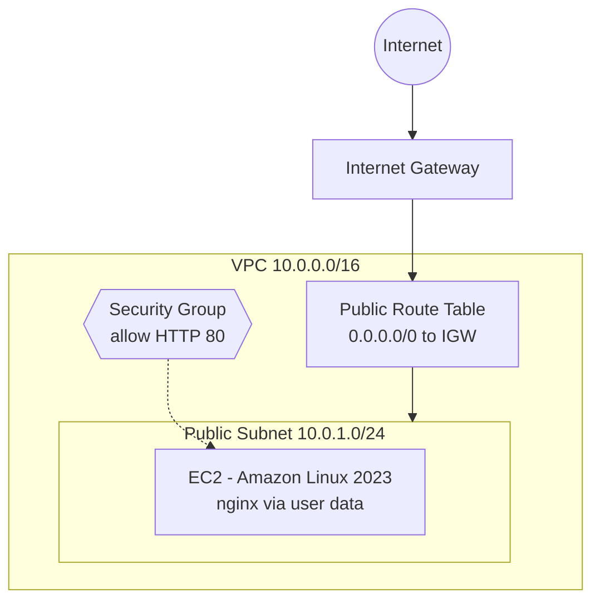

# Terraform: AWS VPC + Web Server (Beginner)

Provisions a VPC, public subnet, Internet Gateway, route table, security group, and an EC2 web server (nginx) on AWS using Terraform. The same infrastructure can be created, changed, and destroyed with a few commands.

## Architecture



## What this project demonstrates
- Infrastructure as Code with the **AWS provider**
- Terraform basics: resources, variables, outputs, data sources, `locals`
- The core workflow: `init`, `plan`, `apply`, `destroy`
- Looking up an AMI dynamically instead of hard-coding an ID
- IMDSv2 enforced on the instance

## Prerequisites
- Terraform >= 1.5 and AWS CLI installed
- An AWS account with credentials configured (`aws configure`)

## Usage
```bash
terraform init      # download the AWS provider
terraform fmt       # format code
terraform validate  # check syntax
terraform plan      # preview changes
terraform apply     # create resources (type yes)
```
Open the `web_url` output in your browser.

```bash
terraform destroy   # delete everything when done
```

## Files
| File | Purpose |
|---|---|
| `versions.tf` | Terraform and provider versions, provider config |
| `variables.tf` | Input variables with defaults |
| `main.tf` | VPC, subnet, IGW, routes, security group, EC2 |
| `outputs.tf` | Values printed after apply |

## Try these to learn more
1. Change `instance_type` and run `plan`. Read what Terraform says it will do.
2. Add a second subnet in another Availability Zone.
3. Add a variable for an SSH rule that allows only your IP.
4. Delete the instance in the console, then run `plan` and see what Terraform detects (drift).

## Cost note
A `t3.micro` instance is inexpensive but not always free. Run `terraform destroy` when finished.

## Author
**Akash Kumar** | [LinkedIn](https://linkedin.com/in/akash-kumar-21bb2b295) | [GitHub](https://github.com/connectak)